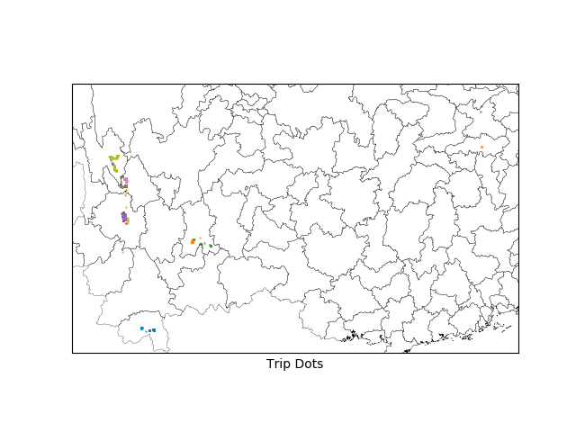

# Tripdots
Dot your pictures from a trip on a map

First, put all the pictures you want to map into a directory in `<path>`

Then, run it by:

```shell
python tripdots.py <path>
```

You will find the date and location information of these pictures in `locationDict.json`

*The information is retreived by the exif information contained in pictures, and no location information will be accessed if you turn off the function of your camera/phone or other devices.*

The dotted map is like:



*The map is generated with `matplotlib`, based on corresponding shapefile. Along with the code there is a public coarse shapefile of China, you may get that of other region from https://gadm.org/.*